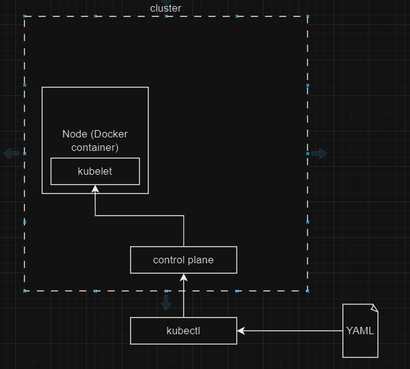

# Learning Kubernetes Inner workings.
This repo is used as a means of documentating my learning of Kubernetes mainly using the [Core Kubernetes](https://www.manning.com/books/core-kubernetes) book.

## Tools used here.
For mimicing a Kubernetes environment locally, the following tools where used:
- [kind](https://kind.sigs.k8s.io/docs/user/quick-start/) - for creating local cluster
- [Docker](https://www.docker.com/) - For creating Nodes in my K8s environment
- [kubectl](https://kubernetes.io/docs/tasks/tools/#kubectl) - For interacting with the cluster.

The examples and notes here will be using `kind` as the cluster type, meaning that our Nodes will be normal docker containers that run the kubelet within them. In the real world K8s Nodes are not limited to Docker containers, and most cases they aren't even Docker containers, they are actual VMs/Physical Machines.

**NOTE: I was using a Linux environment to do all this playing around**

## Frequetly Used Commands:
Here I will keep updating with commands I used while learning:

- Delete Cluster:
```bash
# delete a cluster on the local machine
kind delete cluster --name=<name-of-cluster>
```
- Create Cluster:
```bash
# create a new cluster on the local machine
# creation of a cluster will create a node for us, which is a docker container.
kind create cluster
```

- Create K8s using configuration file:
```bash
kubectl create -f <path-to-yaml-file>
```

- Create a Pod or any other K8s object given a yaml exists [like](./src/simple-pod.yaml):
```bash
# this is for creating K8s
kubectl create -f <path-to-config-yaml>
```

- To Get Running Pods JSON/YAML definition
```bash
kubectl get pods -o=json # get definition of Pod(s) in the cluster as JSON.
kubectl get pods -o=yaml # get definition of Pod(s) in the cluster as YAML. 
```

- Filter out the JSON definition
```bash
# get the first Pod JSON definition from output, the items array has pod objects.
# the go to object status and get property phase
# This will output Running if the Pod is alive, running and well.
kubectl get pods -o=jsonpath='{.items[0].status.phase}'
```

- To execute a command in a container that is inside a Pod:
```bash
# attaching stdin to the container so it can accept stdin from my keyboard
# attching pseudo-TTY to have container termanila behave like a normal (colors, formatting, etc)
kubectl exec --stdin --tty [pod-name] -c [container-name] -- [command]
```

- List all processes running in a linux machine:
```bash
# list all processes running -ax flag list system and user level processes
ps -ax
```

## Getting Started.
For us to be able to simulate a Kubernetes environment locally we first need to start a cluster locally, that we can feed config yaml files to build objects in our K8s environment.

To start a cluster of type kind (a local cluster): `kind create cluster` this will create a cluster with name `kind`. To override the name of the cluster use command `kind create cluster --name=custom-name`

You can always delete the cluster as seen [above](#frequetly-used-commands). When using `kind` to create a local cluster a Node will be created for you which is Docker container that can be seen by executing the command `docker ps`.   

The result should be similar to this:
```bash
# Output of docker ps after creating a kind cluster with kind the command: 
# kind create cluster.

CONTAINER ID   IMAGE                  COMMAND                  CREATED         STATUS         PORTS                       NAMES
c37eed5baf83   kindest/node:v1.30.0   "/usr/local/bin/entr…"   7 minutes ago   Up 7 minutes   127.0.0.1:45259->6443/tcp   kind-control-plane
```
As seen above the image `kindest/node` is used to create a container of a node after we created a cluster, this container will be our Node.

This will result in a environment like this:


That one simple command to create the cluster will create a Node that is a docker container, the Node will have `kubelet` running in it so the control plane can communicate with.

`kubectl` will be our means to communicate with the cluster's control plane, and will feed it config yaml files like [simple-pod.yaml](./src/simple-pod.yaml) to create K8s objects like Pods.

**NOTE: Kubelet has Container Runtime Interface (CRI) that allows it to start, stop Pods. The CRI it also helps with pulling images for containers. A container runtime like Docker implements this so the kubelet can use.**

### Pod Definition:
We can get the created Pod's JSON definition with the command `kubectl get pods -o=json`. This will output a similar result as this:
```json
{
    "apiVersion": "v1",
    "items": [
        {
            "apiVersion": "v1",
            "kind": "Pod",
            "metadata": {
                "creationTimestamp": "2024-07-02T15:32:32Z",
                "labels": {
                    "app": "my-example-app",
                    "creator": "khutso",
                    "organization": "friends-of-manning",
                    "role": "just-an-example"
                },
                "name": "core-k8s",
                "namespace": "default",
                "resourceVersion": "521",
                "uid": "e94c6e84-b724-4991-b97c-1298218a57a7"
            },
            "spec": {
                "containers": [
                    {
                        "command": [
                            "sleep",
                            "10000"
                        ],
                        "image": "docker.io/busybox:latest",
                        "imagePullPolicy": "Always",
                        "name": "busy-box-example",
                        "ports": [
                            {
                                "containerPort": 80,
                                "name": "webapp-port",
                                "protocol": "TCP"
                            }
                        ],
                        "resources": {},
                        "terminationMessagePath": "/dev/termination-log",
                        "terminationMessagePolicy": "File",
                        "volumeMounts": [
                            {
                                "mountPath": "/var/run/secrets/kubernetes.io/serviceaccount",
                                "name": "kube-api-access-cn4wn",
                                "readOnly": true
                            }
                        ]
                    }
                ],
                "dnsPolicy": "ClusterFirst",
                "enableServiceLinks": true,
                //omitted values for clarity...
            }
    ],
    "kind": "List",
    "metadata": {
        "resourceVersion": ""
    }
}

```

To filter the Json to please [see](#frequetly-used-commands).

## Other Experiment Notes